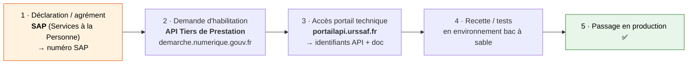
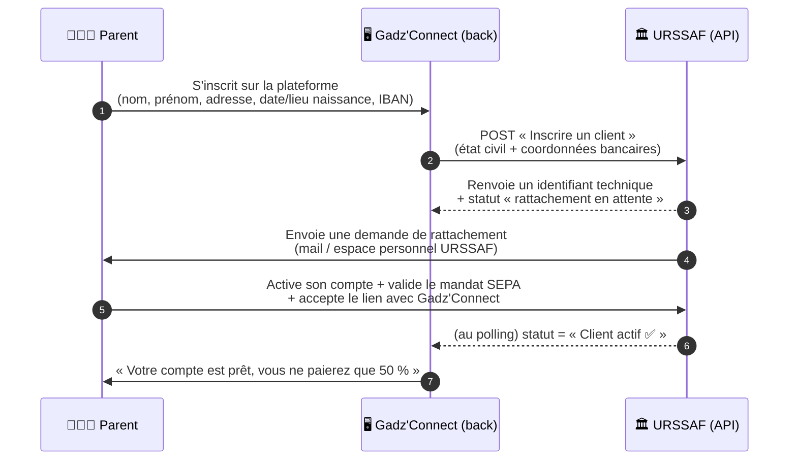
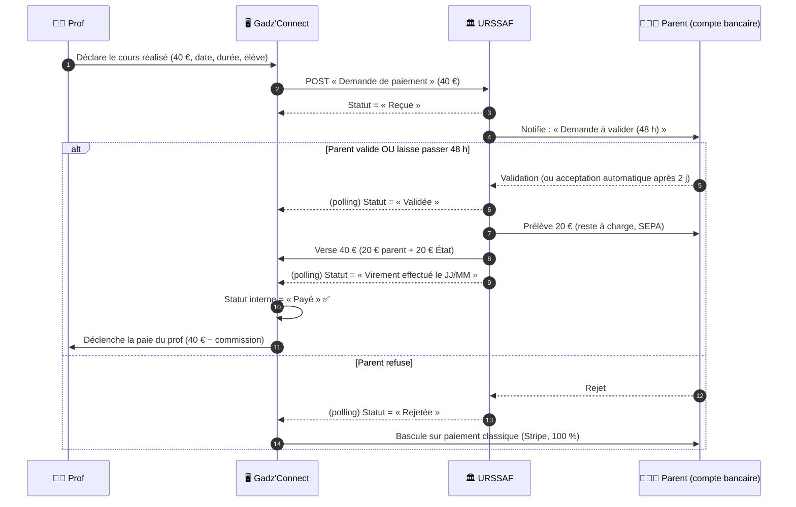
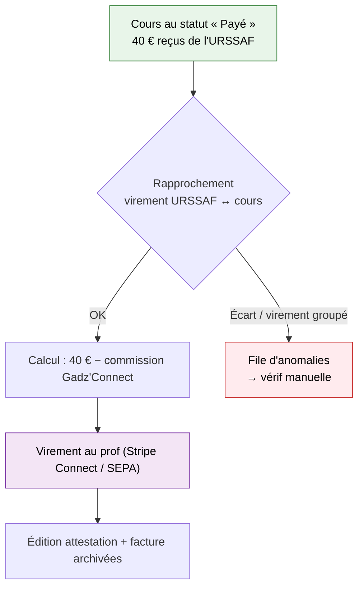

# 🏛️ Avance Immédiate URSSAF — Flux détaillés & automatisation Gadz'Connect

> **Objectif :** le parent ne paie que **50 %** du cours, tout de suite. Les 50 % restants sont
> versés par l'État. **Gadz'Connect encaisse 100 %** au final. Tout est automatisé via
> l'**API Tiers de Prestation** de l'URSSAF.

> ⚠️ **Rappels non négociables**
> - Les cours doivent être **en présentiel au domicile de l'élève** (la visio n'ouvre aucun crédit d'impôt).
> - Ce n'est **pas Stripe** qui encaisse le parent : c'est **l'URSSAF qui prélève le parent en SEPA**.
> - Rien n'est possible sans **agrément SAP + habilitation API** URSSAF (voir §0).

---

## 0. Prérequis (à faire UNE fois, avant tout code)



| # | Étape | Qui | Délai typique |
|---|-------|-----|---------------|
| 1 | Obtenir le **numéro SAP** (déclaration en préfecture / Nova) | Structure Gadz'Connect | 2–8 semaines |
| 2 | Déposer la **demande d'habilitation API** | Structure | quelques semaines |
| 3 | Récupérer **clés API + doc technique** | Dév | immédiat après habilitation |
| 4 | **Recette** (sandbox) : inscription client + demande de paiement de test | Dév | 1–2 semaines |
| 5 | **Prod** | — | — |

**Les 4 méthodes de l'API à intégrer :**
1. `Inscrire un client` (immatriculation du particulier)
2. `Statut de transmission` (savoir si une requête a été prise en compte)
3. `Transmettre une demande de paiement` (la « facture » du cours)
4. `Consulter une demande de paiement` (suivre le statut / le virement)

> ⚠️ L'API fonctionne en **polling** (pas de webhook temps réel). Tu interroges l'URSSAF
> périodiquement (ex. **2×/jour**) pour connaître l'avancement.

---

## 1. Flux — Inscription d'un parent (une fois par parent)

Avant qu'un parent puisse payer 50 %, il faut le **rattacher** à Gadz'Connect côté URSSAF.



**Conditions que le parent doit remplir :**
- Être **domicilié fiscalement en France**.
- Avoir **déjà fait au moins une déclaration de revenus** (sinon pas encore de compte fiscal connu).
- **Accepter le rattachement** à Gadz'Connect + **signer le mandat SEPA** à l'URSSAF.

**Côté données (⚠️ RGPD) :** tu manipules état civil + IBAN. Le **NIR (n° de Sécu)** peut être requis → données sensibles : chiffrement au repos, accès restreint, registre de traitement.

**États à stocker en base pour le parent :**
`INSCRIPTION_ENVOYEE` → `RATTACHEMENT_EN_ATTENTE` → `ACTIF` (ou `REFUSE` / `EXPIRE`).
Tant que le parent n'est pas `ACTIF`, **on ne peut pas déclencher de cours en avance immédiate**.

---

## 2. Flux — Paiement d'un cours (le cœur du système)

À chaque cours réalisé, on transmet une **demande de paiement** de 40 €. L'URSSAF prélève 20 € au parent, ajoute 20 €, et te verse 40 €.



### Enchaînement des statuts (à répliquer en base)

```
Reçue ──▶ En attente de validation ──▶ Validée ──▶ Virement effectué ──▶ Payé
  │            (max 2 jours,               │                                 │
  │           auto-acceptée)               │                                 ▼
  │                                        │                        Paie du prof déclenchée
  └────────────▶ Rejetée ◀─────────────────┘
                    │
                    ▼
        Repli : encaissement Stripe classique (100 %)
```

| Statut URSSAF | Ce que ça veut dire | Action Gadz'Connect |
|---|---|---|
| **Reçue** | Demande enregistrée, parent notifié | Attendre |
| **En attente de validation** | Fenêtre de 48 h (auto-acceptée si silence) | Attendre |
| **Validée** | Parent OK → prélèvement lancé | Rien, l'argent arrive |
| **Virement effectué le [date]** | URSSAF t'a viré les 40 € | Confirmer réception |
| **Payé** | Bouclé | **Déclencher la paie du prof** |
| **Rejetée** | Parent a refusé | **Repli Stripe** (facturer 100 %) |

---

## 3. Flux — Reversement au prof & rapprochement comptable



⚠️ **Point de trésorerie** : entre la déclaration et le virement URSSAF, il se passe **plusieurs jours**. Deux stratégies :
- **Prudente** : tu payes le prof **après** réception des 40 € de l'URSSAF (aucun risque de trésorerie).
- **Confort prof** : tu **avances** la paie du prof et te fais rembourser par l'URSSAF (nécessite de la trésorerie + gérer le risque de rejet).

---

## 4. Ce qu'il faut construire (checklist technique)

| Brique | Rôle |
|--------|------|
| **Client API URSSAF** | Wrapper des 4 méthodes (inscription, statut, demande, consultation) + gestion des tokens/certificats |
| **Machine à états Parent** | `INSCRIPTION_ENVOYEE → RATTACHEMENT_EN_ATTENTE → ACTIF / REFUSE` |
| **Machine à états Cours** | `Reçue → En attente → Validée → Virement → Payé / Rejetée` |
| **Job de polling (cron 2×/jour)** | Interroge l'URSSAF, met à jour les statuts, déclenche les actions |
| **Repli Stripe** | Si parent non-`ACTIF` ou demande `Rejetée` → facturation classique 100 % |
| **Module de reversement prof** | Calcul commission + virement + attestation |
| **Rapprochement bancaire** | Matcher les virements URSSAF (souvent groupés) avec les cours |
| **Coffre données sensibles** | Chiffrement IBAN / NIR, registre RGPD, accès restreint |
| **Journal d'audit** | Traçabilité de chaque échange API (obligation de contrôle) |

---

## 5. 📋 Résumé du process (la version « une page »)

**Une seule fois, au démarrage de la boîte :**
1. Obtenir le **numéro SAP**.
2. Obtenir l'**habilitation API Tiers de Prestation** (URSSAF).
3. Intégrer les **4 méthodes de l'API** + un **job de polling 2×/jour**.

**Une fois par parent :**
4. Le parent s'inscrit → on l'**immatricule** auprès de l'URSSAF (état civil + IBAN).
5. Le parent **valide le rattachement** + signe le **mandat SEPA** dans son espace URSSAF.
6. Statut parent = **ACTIF** → il peut désormais payer 50 %.

**À chaque cours (100 % automatisé) :**
7. Le prof déclare le cours (40 €).
8. Gadz'Connect envoie une **demande de paiement** à l'URSSAF.
9. Le parent a **48 h** pour valider (sinon accepté automatiquement).
10. L'URSSAF **prélève 20 € au parent** + ajoute **20 €** → **verse 40 €** à Gadz'Connect.
11. Au statut **« Payé »**, Gadz'Connect **paye le prof** (40 € − commission).
12. En cas de **rejet** → repli automatique sur **Stripe (100 %)**.

**Ce que vit le parent :** il s'inscrit une fois, valide une fois → ensuite, **il ne paie plus que 20 € par cours, prélevés automatiquement. C'est tout.**

---

### Sources
- [URSSAF — L'API Tiers de prestation (FAQ prestataire)](https://www.urssaf.fr/portail/home/employeur-du-secteur-des-service/prestataire/foire-aux-questions/lapi-tiers-de-prestation.html)
- [data.gouv.fr — API Tiers de prestation](https://www.data.gouv.fr/dataservices/api-tiers-de-prestation)
- [demarche.numerique.gouv.fr — Habilitation API Tiers de Prestations](https://demarche.numerique.gouv.fr/commencer/api-tiers-de-prestations)
- [Abby — FAQ API Tiers de prestations (statuts, délais)](https://aide.abby.fr/fr/articles/6657446-faq-avance-immediate-de-credit-d-impot-api-tiers-de-prestations)
- [URSSAF — Facturation & demande de paiement (délais de versement)](https://www.urssaf.fr/portail/home/employeur-du-secteur-des-service/prestataire/foire-aux-questions/facturation-demande-de-paiement.html)
