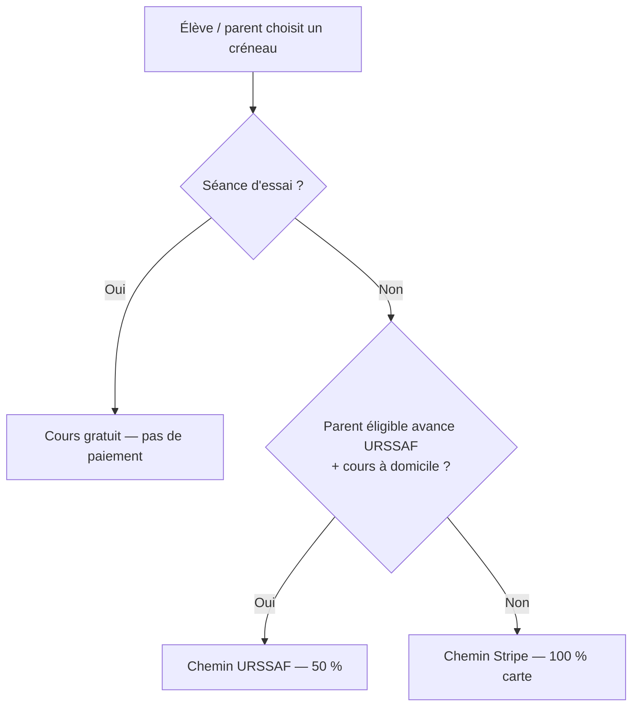
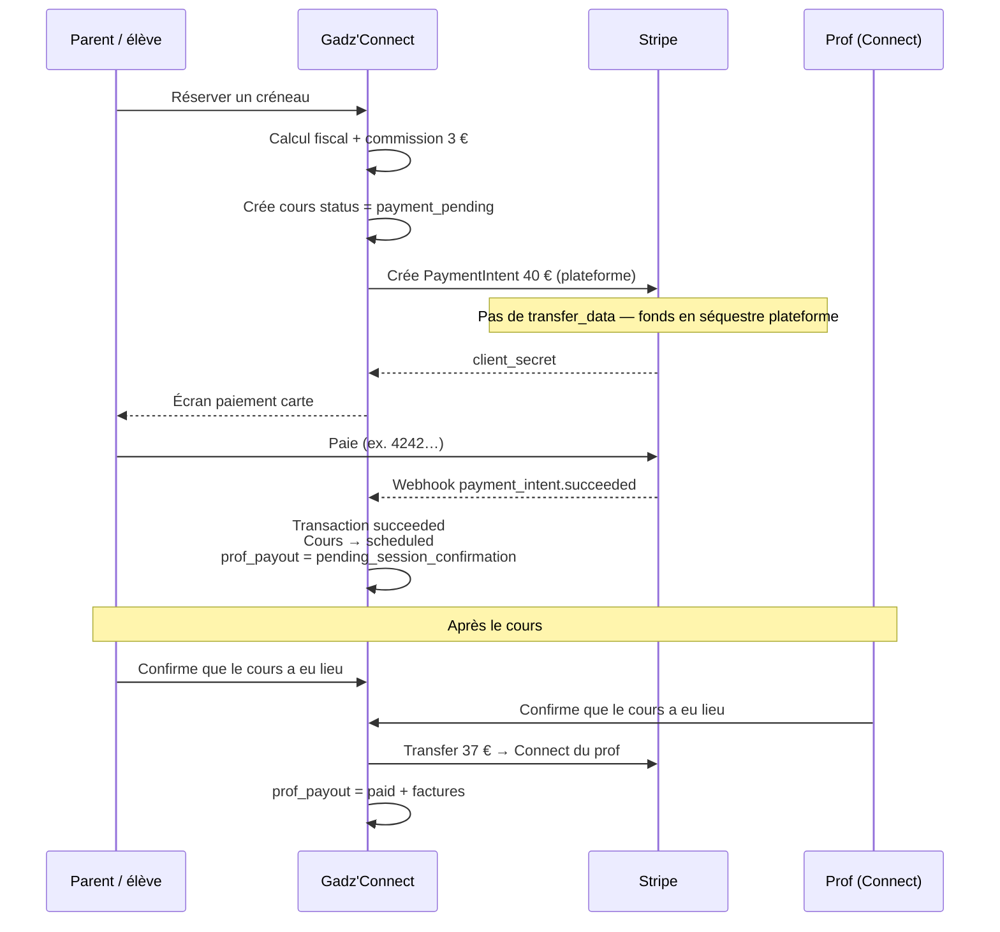
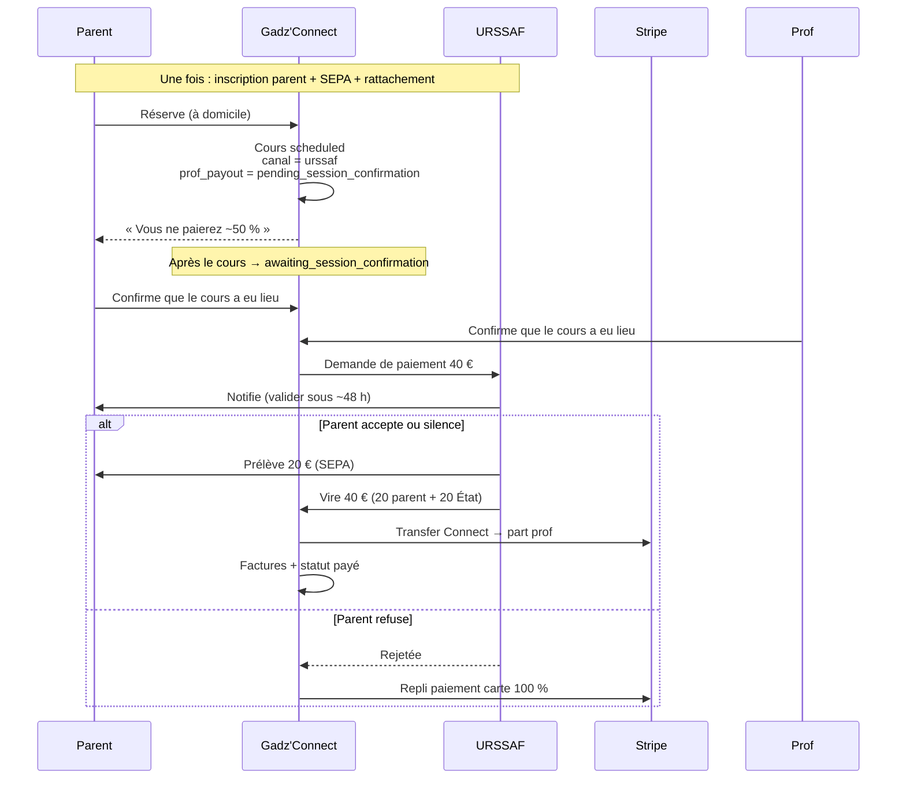
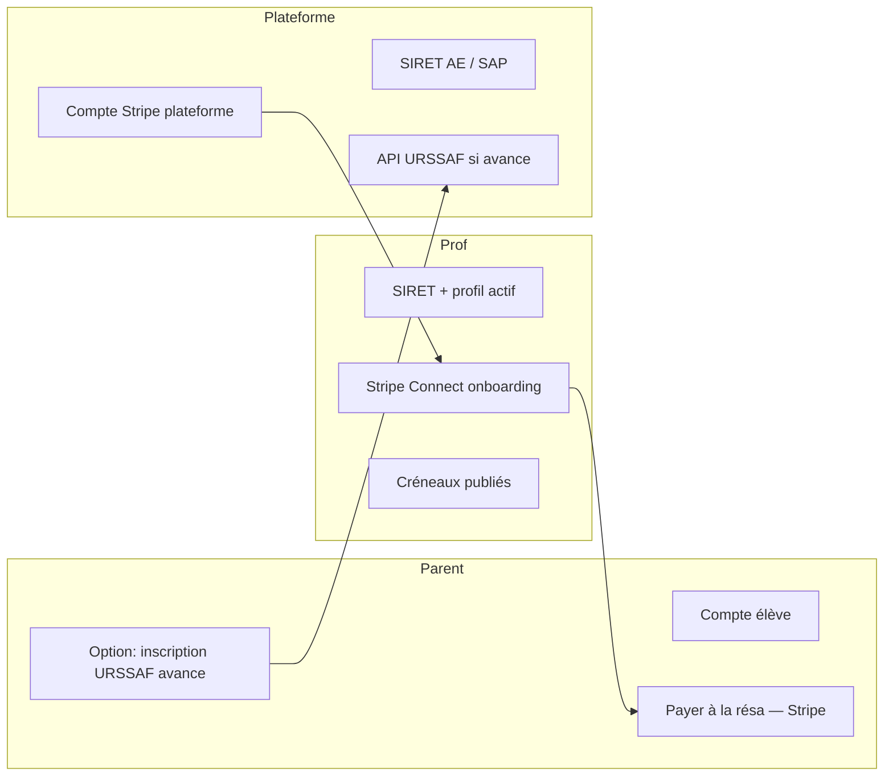

# Flux de paiement — Gadz'Connect

Comment l’argent circule sur la plateforme, **tel que le code le fait aujourd’hui**.

**Exemple de base** : cours à **40 €** · commission plateforme **3 €** · prof sans ACRE.

| Poste | Montant |
|-------|---------|
| Payé par le parent (brut) | 40,00 € |
| Commission Gadz'Connect | −3,00 € |
| CA brut prof (avant cotisations) | 37,00 € |
| URSSAF tuteur ~21,1 % (indicatif) | −7,81 € |
| **Net estimé prof** | **~29,19 €** |

> Les cotisations URSSAF du **prof** sont calculées / affichées pour l’aider à déclarer.  
> Ce n’est **pas** Gadz'Connect qui les reverse automatiquement à l’URSSAF en V1 (sauf flux avance immédiate parent, ci-dessous).

---

## Vue d’ensemble : 3 chemins



---

## Chemin A — Stripe (paiement carte, cas principal MVP)

C’est le flux **par défaut** tant que l’avance immédiate n’est pas active pour ce parent.



### Étapes utilisateur

1. Marketplace → profil tuteur → créneau  
2. Réservation (`POST /api/tutors/bookings`)  
3. Si Stripe OK → **paiement obligatoire** avant confirmation  
4. Carte → succès → cours **confirmé** (`scheduled`)  
5. Rappels / confirmation présence ~24 h avant  
6. Cours a lieu → statut `awaiting_session_confirmation`  
7. **Double confirmation post-séance** (élève + prof)  
8. Transfer Stripe vers le prof + factures  

### Qui reçoit quoi (Stripe Connect)

- Parent paie **40 €** à Stripe (compte **plateforme**).  
- Après double confirmation : Transfer **37 €** vers le Connect du prof.  
- Commission **3 €** reste sur la plateforme.  
- Statut interne : `payment_channel = stripe`, `prof_payout_status = pending_session_confirmation` → `paid`.

### Si le cours est annulé

- Remboursement Stripe possible (`refund`) selon les règles d’annulation / remplacement / litige admin.

---

## Chemin B — Avance immédiate URSSAF (parent paie ~50 %)

Actif seulement si **toutes** ces conditions sont vraies :

- API URSSAF opérationnelle (`URSSAF_API_ENABLED` ou mock)  
- Parent **inscrit et actif** côté URSSAF (mandat SEPA + rattachement)  
- Cours **à domicile** (`isHomeVisit = true`) — **pas la visio**



### Timing

| Moment | Quoi |
|--------|------|
| À la réservation | Pas de carte ; cours déjà `scheduled` |
| Après le cours | Attente **double confirmation** (élève + prof) |
| Après les 2 confirms | Demande de paiement URSSAF |
| ~48 h | Validation parent (ou auto) |
| Quelques jours | Prélèvement 50 % + virement 100 % à la plateforme |
| Après virement | Reversement prof via **Stripe Transfer** |

**Pas instantané.**

---

## Chemin C — Séance d’essai

- `session_type = trial`  
- **0 €**, pas de PaymentIntent  
- Cours directement `scheduled`  
- Une seule essai par couple élève ↔ tuteur

---

## Prérequis côté acteurs



Sans **Stripe Connect** du prof → réservation carte **bloquée** (sauf chemin URSSAF éligible).

---

## Statuts utiles (côté base)

### Cours
| Statut | Sens |
|--------|------|
| `payment_pending` | Attente paiement Stripe |
| `scheduled` | Confirmé / à venir |
| `completed` | Passé (déclenche URSSAF si canal urssaf) |
| `cancelled` | Annulé |
| `awaiting_replacement` | Remplacement en cours |

### Transaction
| Champ | Sens |
|-------|------|
| `payment_channel` | `stripe` ou `urssaf` |
| `status_stripe` | `pending` → `succeeded` / `refunded` |
| `prof_payout_status` | `paid_at_booking` (Stripe) ou `pending_urssaf` → `paid` |
| `commission_sasu` | Commission plateforme (3 €) — nom historique |

---

## Schéma argent — résumé

### Stripe (100 %)
```
Parent 40 € → Stripe (compte plateforme)
   └─ après double confirmation post-séance
        ├─ 3 €  restent Gadz'Connect
        └─ 37 € Transfer → Prof (Connect)
```

### URSSAF (50 %)
```
Parent 20 € (SEPA) + État 20 €
   └─ URSSAF vire 40 € → Gadz'Connect
        └─ puis Transfer Stripe → Prof (après double confirm + URSSAF payé)
```

---

## Points d’attention produit

1. **MVP réel aujourd’hui** = surtout le **chemin Stripe**.  
2. **URSSAF** = après SAP + habilitation API ; sinon le code reste en mock / désactivé.  
3. Confirmation de présence (~24 h) = anti no-show **avant** le cours.  
4. **Double confirmation post-séance** (élève + prof) = obligatoire avant tout paiement au prof (Stripe Transfer ou demande URSSAF).  
5. Sans les deux confirms sous **7 jours** → litige admin (forcer paiement ou rembourser).  
6. En Stripe, les fonds sont **séquestrés sur la plateforme** à la réservation ; le prof n’est payé qu’après les deux validations.

---

*Aligné sur `POST /api/tutors/bookings`, `confirm-attendance`, `lib/billing/session-payout.ts`, `lib/urssaf/payment.ts`, commission `COMMISSION_SASU_EUR = 3`.*
