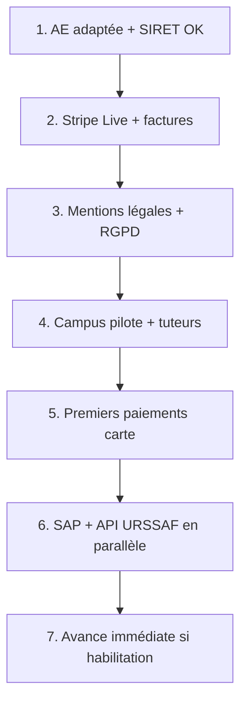

# Guide de lancement — rester en auto-entrepreneur (AE)

**Décision** : tu ne crées **pas** de SASU pour l’instant. Tu lances Gadz'Connect avec **ton auto-entreprise existante**.  
**Plus tard** : bascule SASU si le pilote marche (accord école, volume, Stripe, associé…).

> Ce n’est pas un conseil juridique. Valide activité APE, TVA et flux marketplace avec un comptable (1 RDV suffit).

**Docs liées** :
- Plan admin général : [`PLAN_FINALISATION_ADMIN.md`](PLAN_FINALISATION_ADMIN.md)
- SAP + habilitation : [`../guide-creation-structure-sap-habilitation.md`](../guide-creation-structure-sap-habilitation.md)
- Avance immédiate technique : [`../avance-immediate-automatisation-1.md`](../avance-immediate-automatisation-1.md)
- Pilote produit : [`MVP-PILOTE.md`](MVP-PILOTE.md)

---

## Principe



- **Profs** = auto-entrepreneurs (leur micro).  
- **Toi** = plateforme en AE (commission).  
- **Compatible** : oui, c’est le modèle du produit.

---

## Vue d’ensemble — checklist

| # | Action | Bloquant pour | Durée | Statut |
|---|--------|---------------|-------|--------|
| 0 | Gel code (sauf bugs démo/paiement) | Focus | 30 min | ☐ |
| 1 | Vérifier / adapter ton AE (activité) | Tout | 1–7 j | ☐ |
| 2 | Compte bancaire pro AE + Drive legal | Stripe, factures | 1–2 j | ☐ |
| 3 | Remplir `.env` plateforme (SIRET AE) | Factures PDF | 30 min | ☐ |
| 4 | Mentions légales / CGU / CGV / confidentialité | Site public | 2–5 j | ☐ |
| 5 | Domaine + emails + hébergement | Go-live | 1–3 j | ☐ |
| 6 | Stripe Connect **Live** + KYB (ton AE) | Paiement parents | 1–4 sem. | ☐ |
| 7 | Accord campus pilote (écrit / mail) | Acquisition | 2–6 sem. | ☐ |
| 8 | Recruter 10–20 tuteurs (parcours express SIRET) | Marketplace | Continu | ☐ |
| 9 | 1er paiement carte réel (1 € test puis vrai cours) | Validation | 1 j | ☐ |
| 10 | Déclaration **SAP** NOVA | Avance 50 % | ≤ 8 j ouvrés | ☐ |
| 11 | Demande **habilitation API** URSSAF | Avance auto | plusieurs sem. | ☐ |
| 12 | Brancher API prod + test avance immédiate | Feature 50 % | après 11 | ☐ |
| 13 | (Plus tard) Bascule SASU | Scale | quand signal | ☐ |

---

## 0. Gel du code

Le produit est « assez bon » si : auth, onboarding micro tuteurs, marketplace, Stripe Connect tuteurs (test), admin RH.

**Plus tard** : polish UI, % commission, planning iCal, etc.  
**Maintenant** : bugs bloquants démo / paiement / conformité seulement.

---

## 1. Adapter ton auto-entreprise (pas tout refaire)

Tu as déjà un SIRET → **modification**, pas création.

### À faire sur [formalites.entreprises.gouv.fr](https://formalites.entreprises.gouv.fr)

1. Connexion (FranceConnect / compte).
2. **Modification** de ton entreprise individuelle / micro.
3. Vérifier ou ajouter une activité cohérente avec :
   - plateforme / mise en relation / services numériques **et/ou**
   - enseignement / soutien scolaire  
   → codes souvent cités dans le projet : **85.59B** (soutien scolaire) ou **85.59A / 85.59W** (formation adultes) — **à confirmer avec le comptable**.
4. Noter : SIREN, SIRET, APE, adresse, périodicité URSSAF.

### Règles à avoir en tête

- **Plafond micro services** ≈ 77 700 € CA/an — si tu t’en approches → bascule SASU.
- Cumul d’activités : depuis 2025, règles SAP / activité accessoire (souvent &lt; 30 % CA accessoire) — **comptable**.
- Tu restes responsable **à titre personnel**.

### Drive `GadzConnect-Legal/`

- [ ] Capture / PDF extrait SIRENE  
- [ ] Récépissé modification activité  
- [ ] Pièce d’identité  
- [ ] RIB compte pro AE  

**Sortie** : SIRET actif + activité alignée Gadz'Connect.

---

## 2. Banque + organisation

- [ ] Compte **pro AE** (même en micro : Shine, Qonto, banque… — séparer perso / business)
- [ ] Toutes les commissions Stripe → ce compte
- [ ] Ne jamais mélanger avec ton argent perso « à la louche »

---

## 3. Config technique plateforme (ton AE = la plateforme)

Dans `apps/api/.env` (prod) :

```env
GADZ_PLATFORM_LEGAL_NAME=Jules Henri — Gadz'Connect
# ou le nom commercial que tu utilises
GADZ_PLATFORM_SIRET=XXXXXXXXXXXXXX
GADZ_PLATFORM_ADDRESS=ton adresse AE
GADZ_SAP_NUMBER=SAP-XXXXXXXXX
# ← à remplir après déclaration NOVA ; placeholder OK avant
GADZ_VAT_APPLICABLE=false
# sauf si le comptable dit autrement
GADZ_BILLING_EMAIL_FROM=facturation@tondomaine.fr
GADZ_APP_URL=https://...
```

Le code lit ces variables pour les **factures PDF** (`getPlatformBillingConfig`).  
Le libellé `commission_sasu` dans le code = historique ; **pas besoin d’être en SASU**.

---

## 4. Documents site (obligatoires)

| Document | Contenu AE |
|----------|------------|
| **Mentions légales** | Nom + prénom, SIRET, adresse, contact, hébergeur |
| **CGU** | Compte, rôles, usage |
| **CGV marketplace** | Commission, annulation, rôle d’**intermédiaire** |
| **Confidentialité** | RGPD, durées, droits |

**Phrase obligatoire** (déjà dans le produit) :  
Gadz'Connect **guide** la création de micro des tuteurs (PDF INPI), **ne crée pas** l’entreprise à leur place.

Option : modèles Legalstart / Captaine Contrat / avocat — mieux qu’un copier-coller brut.

---

## 5. Domaine, emails, prod

- [ ] Domaine (`gadzconnect.fr` ou dispo)
- [ ] DNS → front + API
- [ ] Resend : domaine vérifié + `GADZ_PLATFORM_EMAIL_FROM`
- [ ] HTTPS, secrets prod, alertes budget cloud
- [ ] Voir aussi [`MVP-PILOTE.md`](MVP-PILOTE.md)

---

## 6. Stripe Live (paiement des parents par carte)

C’est le **premier** mode de paiement à activer (avant l’avance URSSAF).

1. Compte Stripe au nom de **ton AE** (identité = toi).
2. Activer **Stripe Connect** → **Express** (comme le code).
3. Remplir le KYB (pièce ID, RIB, activité marketplace / services).
4. Clés `sk_live_…`, webhook live, `STRIPE_WEBHOOK_SECRET`.
5. Test : paiement **1 €** puis remboursement.
6. Parcours réel : élève réserve → paie carte → commission → Connect tuteur.

**Si Stripe refuse / bloque** → signal pour créer une **SASU** plus tard.

Tant que Stripe Live n’est pas OK : pas de vrais paiements parents.

---

## 7. Campus pilote

- 1 campus (ex. Aix).
- Interlocuteur RH / études / BDE.
- Argument : **gratuit pour le campus**, commission sur les cours seulement.
- Demander un **accord écrit** (même un mail) : pilote X mois, données, responsabilités.

Livrables à emmener : démo admin, 1-pager conformité (« chaque tuteur a un SIRET »), business plan provisoire.

---

## 8. Tuteurs (eux = AE, pas toi)

Prioriser le parcours **express** (SIRET déjà existant) :

1. Setup profil  
2. Questionnaire fiscal + SIRET → actif  
3. Stripe Connect  
4. Créneaux publiés  

Objectif : **10–20** tuteurs avec créneaux avant de pousser fort côté élèves.

Les tuteurs restent **indépendants**. Toi = plateforme. **Pas incompatible.**

---

## 9. Premier euro réel

Checklist « prêt à encaisser » :

- [ ] SIRET AE + mentions légales en ligne  
- [ ] Stripe Live + webhook OK  
- [ ] Au moins 1 tuteur Connect actif  
- [ ] 1 paiement test réel OK  
- [ ] Facture PDF générée avec ton SIRET  

Ensuite : vrais cours payés par carte.

---

## 10. Déclaration SAP (pour le crédit d’impôt / avance 50 %)

**Sans SASU, c’est possible** : déclaration sur **ton SIRET AE**.

1. Compte sur le portail **NOVA** (services à la personne).
2. Déclaration activité **soutien scolaire / cours à domicile** (déclaration simple, pas agrément lourd).
3. Gratuit → récépissé sous **~8 jours ouvrés**.
4. Copier le numéro dans `GADZ_SAP_NUMBER`.

**Conditions dures** (sinon refus / pas d’avance) :
- Cours **présentiel au domicile de l’élève** (visio = pas d’avance immédiate dans le produit).
- Facturation / traçabilité propres.
- Activité cohérente (comptable).

Détail : [`guide-creation-structure-sap-habilitation.md`](../guide-creation-structure-sap-habilitation.md).

---

## 11. Habilitation API URSSAF (avance immédiate)

1. Prérequis : récépissé **SAP**.
2. Demande sur [demarche.numerique.gouv.fr](https://www.demarche.numerique.gouv.fr) — « API Tiers de Prestations ».
3. Joindre : SIRET, SAP, infos légales, RGPD, moyens de paiement.
4. Attendre habilitation → accès `portailapi.urssaf.fr` + sandbox.
5. Ensuite seulement : `URSSAF_API_ENABLED=true` + certificats dans le `.env`.

**Délai** : souvent plusieurs semaines.  
**En attendant** : les parents paient en **carte Stripe** (déjà prévu dans le code ; repli auto si URSSAF pas actif).

---

## 12. Brancher l’avance immédiate (quand API OK)

Ordre technique (déjà dans le code) :

1. Sandbox / mock → tests  
2. Inscription parent (`/api/urssaf/enroll`)  
3. Parent valide rattachement + mandat SEPA côté URSSAF  
4. Réservation `isHomeVisit` + canal `urssaf`  
5. Après cours : demande de paiement → polling → virement  
6. Reversement prof (selon runbook trésorerie)

Sans étape 10–11, cette phase reste **off**.

---

## 13. Quand basculer en SASU (plus tard)

Crée la SASU **seulement** si :

| Signal | Pourquoi |
|--------|----------|
| Accord école formalisé | Crédibilité contrats |
| Stripe bloque / limite l’AE | KYB marketplace |
| Co-fondateur / investisseur | Parts, gouvernance |
| CA proche du plafond micro | Obligation de sortir du micro |
| Tu veux séparer perso / boîte | Responsabilité limitée |

À la bascule : nouveau SIRET → mettre à jour `.env` → **re**-déclarer SAP sur la société → **re**-demander l’API si besoin → notifier Stripe.

---

## Planning type — 4 semaines (mode AE)

### Semaine 1
- Modifier activité AE si besoin  
- Compte pro + Drive legal  
- Domaine / mails  
- Remplir `.env` SIRET  
- RDV comptable 30 min (APE + commission marketplace)

### Semaine 2
- Mentions / CGU / CGV / confidentialité  
- Stripe Live + KYB  
- Contact campus  

### Semaine 3
- Tuteurs express (atelier 15 min)  
- Déclaration **SAP** NOVA  
- 1er paiement carte test  

### Semaine 4
- Vrais cours payés  
- Dépôt demande **API URSSAF** (si SAP reçu)  
- Répéter acquisition tuteurs / élèves  

---

## Ce que tu fais ce soir

1. Noter ton **SIRET** + APE actuel.  
2. Créer le Drive `GadzConnect-Legal/`.  
3. Prendre RDV comptable : « marketplace commission + SAP éventuel en micro ».  
4. Ouvrir / vérifier compte **Stripe** (même en test).  
5. Lister 5–10 tuteurs potentiels (parcours express).  
6. Mail / message interlocuteur campus pour un créneau démo.

---

## Récap une phrase

**Reste en AE → paie en Stripe → recrute tuteurs → déclare SAP → demande l’API → avance 50 % quand c’est prêt → SASU seulement si ça scale.**
