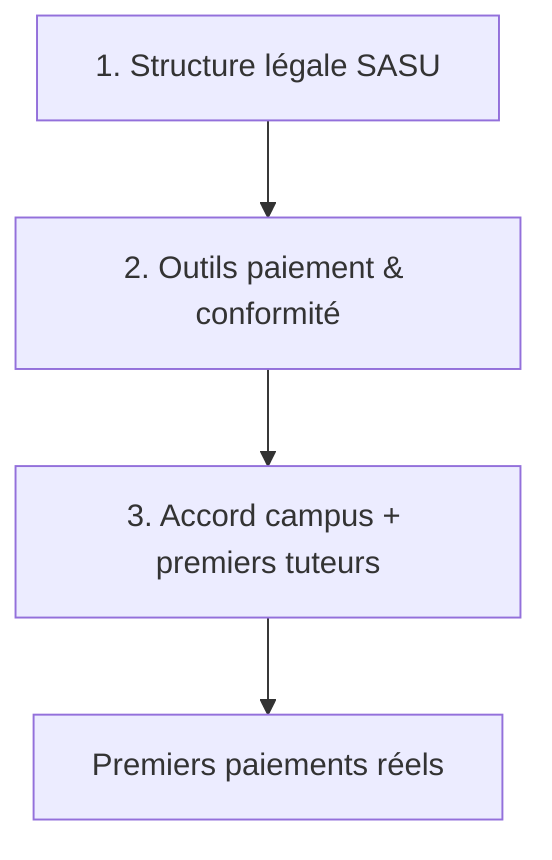

# Plan de finalisation administrative — Gadz'Connect

**Contexte** : le code MVP est quasiment prêt. Les retouches produit se font **plus tard**. Priorité = tout ce qui est **juridique / fiscal / conformité / partenariats**, sans quoi tu ne peux pas encaisser légalement ni lancer un campus pilote.

**Décision actuelle** : lancer en **auto-entrepreneur** (pas de SASU pour l’instant).  
→ Guide opérationnel : `[GUIDE_LANCEMENT_AE.md](GUIDE_LANCEMENT_AE.md)`

**Structure cible long terme** : SASU **Gadz'Connect** (quand le pilote est validé) — APE type formation / soutien scolaire  
**Modèle** : marketplace, commission sur les cours (campus gratuits)

> Ce document n’est pas un conseil juridique. Fais valider les CGU/CGV, le statut et le flux Stripe par un expert-comptable / avocat si tu as un doute.  
> Les sections « créer la SASU » ci-dessous restent valables pour la **bascule future** ; pour le lancement immédiat, suivre le guide AE.

---

## Principe : 3 couches à débloquer

Sans **1** → pas de SIRET plateforme, pas de KYB Stripe prod.  
Sans **2** → pas d’encaissement.  
Sans **3** → produit vide même si tout est légal.

---

## Vue d’ensemble (ordre recommandé)

| #   | Action                                       | Bloquant pour      | Durée typique  | Statut |
| --- | -------------------------------------------- | ------------------ | -------------- | ------ |
| 1   | Gel code / backlog retouches                 | Focus admin        | 30 min         | ☐      |
| 2   | Créer la SASU (Guichet Unique)               | Tout le reste      | 1–3 sem. SIREN | ☐      |
| 3   | Compte pro + capital + KBIS                  | Stripe, factures   | 1–2 sem.       | ☐      |
| 4   | Expert-comptable + obligations               | Paie / TVA / bilan | 1 RDV          | ☐      |
| 5   | Mentions légales, CGU, CGV, confidentialité  | Mise en ligne      | 2–5 j          | ☐      |
| 6   | RGPD (registre + hébergement UE)             | Conformité         | 1–2 j          | ☐      |
| 7   | Domaine + emails + hébergement prod          | Go-live            | 1–3 j          | ☐      |
| 8   | Stripe Connect **mode Live** + KYB           | Premiers paiements | 2–4 sem.       | ☐      |
| 9   | Accord campus pilote (écrit)                 | Acquisition        | 2–6 sem.       | ☐      |
| 10  | Lancer demande API URSSAF Tiers de Confiance | Auto fiscale V2    | 3–6 mois       | ☐      |
| 11  | (Option) Marque INPI « Gadz'Connect »        | Protection nom     | 1–2 j dépôt    | ☐      |
| 12  | Checklist go-live + 20 tuteurs               | Lancement          | Continu        | ☐      |

---

## 1. Gel du code (ce qu’on ne fait plus maintenant)

**Considère le produit “assez bon pour piloter” si** :

- Auth + rôles + campus OK  
- Onboarding micro (express / complet) + PDF guide INPI OK  
- Marketplace + réservation OK  
- Stripe Connect Express (tuteurs) OK en **test**  
- Admin RH utilisable

**Backlog plus tard** (ne bloque pas l’admin) :

- Alignement commission code ↔ business plan (3 € / 5 € / 15 %)  
- Polish UI, module planning iCal, multi-écoles  
- Automatisation URSSAF totale (dépend de l’habilitation)

**Règle** : jusqu’au go-live, ne toucher au code que pour un **bug bloquant démo / conformité / paiement**.

---

## 2. Créer la SASU Gadz'Connect (toi / fondateurs)

C’est **la** déclaration à faire en premier : l’entreprise plateforme, pas la micro des tuteurs.

### Documents / infos à préparer

- [ ] Statuts SASU (modèle avocat / Legalstart / Captain Contrat — à adapter)
- [ ] Nom : **Gadz'Connect** (vérifier disponibilité INPI + `.fr` / `.com`)
- [ ] Siège social (domicile, domiciliation, ou local)
- [ ] Objet social : marketplace de mise en relation / services numériques liés au tutorat & accompagnement micro-entreprise (faire rédiger proprement)
- [ ] Capital social (souvent 1 € à quelques centaines € pour démarrer — décider avec l’associé/comptable)
- [ ] Président : toi (ou co-fondateur)
- [ ] Pièce d’identité, justificatif de domicile

### Où déclarer

1. [formalites.entreprises.gouv.fr](https://formalites.entreprises.gouv.fr) (Guichet Unique INPI)
2. Nature : **Société** → **SASU**
3. Activité principale : viser **85.59W** (à confirmer avec le comptable selon l’objet exact)
4. Immatriculation au RCS → obtention **SIREN / SIRET** + extrait **KBIS**

### Après validation

- [ ] Noter SIREN, SIRET, date d’immatriculation
- [ ] Créer le dossier Drive : `GadzConnect-Legal/` (statuts, KBIS, pièce ID, récépissés)

**Délai** : souvent **1 à 3 semaines** après dossier complet.

---

## 3. Banque pro + capital

- [ ] Ouvrir un **compte professionnel** au nom de la SASU (Qonto, Shine, banque classique…)
- [ ] Déposer le capital si exigé par les statuts
- [ ] Récupérer RIB pour Stripe + facturation
- [ ] Séparer strictement : compte perso ≠ compte SASU ≠ fonds marketplace (Stripe)

Sans compte pro + KBIS, le **KYB Stripe Live** sera refusé ou bloqué.

---

## 4. Expert-comptable (à prendre tôt)

À clarifier dès le 1er RDV :

- [ ] Régime TVA (franchise en base vs TVA réelle — critique pour marketplace)
- [ ] Traitement de la **commission** marketplace
- [ ] Obligations de facturation (vos factures commission vs factures tuteurs)
- [ ] Tenue comptable + liasse fiscale
- [ ] Faut-il un **compte de cantonnement / séquestre** explicite côté métier (au-delà de Stripe)

**Livrable** : 1 page « règles comptables Gadz'Connect » pour cadrer le code (commission, TVA, libellés factures).

---

## 5. Documents site (obligatoires avant ouverture)

| Document                         | Contenu minimal                                             | Statut |
| -------------------------------- | ----------------------------------------------------------- | ------ |
| **Mentions légales**             | SASU, SIRET, siège, contact, hébergeur                      | ☐      |
| **CGU**                          | Compte, rôles, interdiction d’usage abusif, résiliation     | ☐      |
| **CGV / conditions marketplace** | Commission, annulation, litiges cours, rôle d’intermédiaire | ☐      |
| **Politique de confidentialité** | Finalités, base légale, durée conservation, droits RGPD     | ☐      |
| **Politique cookies**            | Si tracking analytics                                       | ☐      |

**Point critique produit** (déjà dans le plan technique) :  
Gadz'Connect **guide** la création de micro-entreprise (PDF INPI), **ne crée pas** l’entreprise à la place du tuteur. Ça doit être **écrit noir sur blanc** dans les CGU + dans l’UI d’onboarding.

Modèles possibles : Legalstart / Captaine Contrat / avocat startup — mieux qu’un copier-coller ChatGPT pour une marketplace qui touche à l’argent.

---

## 6. RGPD (rapide mais non optionnel)

- [ ] Hébergement **UE** (Supabase `eu-`*, GCP `europe-west1` — déjà prévu)
- [ ] Registre des traitements (même simple, tableur) : comptes, messages, SIRET, transactions
- [ ] Durées : perso ~3 ans inactivité ; comptable **10 ans**
- [ ] Droit d’accès / effacement (anonymisation + conservation lignes comptables)
- [ ] DPA / avenants avec sous-traitants : Supabase, Stripe, Resend, GCP
- [ ] Si cookies analytics : bandeau + consentement

---

## 7. Domaine, emails, prod (infra “officielle”)

- [ ] Acheter domaine (`gadzconnect.fr` ou équivalent disponible)
- [ ] DNS → front + API (Cloud Run / autre)
- [ ] Vérifier domaine **Resend** (factures / magic links)
- [ ] Variables prod : `GADZ_APP_URL`, `GADZ_PLATFORM_*`, clés **live** Stripe, secrets Supabase
- [ ] HTTPS partout
- [ ] Sauvegardes BDD + alertes budget cloud

Checklist technique déjà amorcée dans `docs/MVP-PILOTE.md` (hors scope code ici).

---

## 8. Stripe Connect Live + KYB (bloquant paiements réels)

### Avant

- [ ] SASU créée + KBIS + RIB pro
- [ ] Compte Stripe au nom de la **SASU**
- [ ] Activer **Connect Express** (comme en test)
- [ ] Remplir le profil plateforme (KYB) : dirigeants, bénéficiaires effectifs, activité

### Ensuite

- [ ] Passer les clés `sk_live_…` / webhook live
- [ ] Tester 1 paiement réel à 1 € puis remboursement
- [ ] Vérifier split commission + compte Connect tuteur
- [ ] Documenter le runbook litige / remboursement

**Délai KYB** : souvent **2–4 semaines** — démarrer dès le KBIS en main.

---

## 9. Accord campus pilote (ENSAM)

Sans accord écrit, tu restes en “outil perso”.

### Cible

- 1 campus (ex. Aix)  
- Interlocuteur : RH / direction des études / BDE selon le campus  
- Offre : **gratuit pour le campus**, commission uniquement sur les cours

### Livrables à emmener

- [ ] Pitch 1 page + business plan provisoire (`docs/GadzConnect-Business-Plan-PROVISOIRE.md`)
- [ ] Fiche conformité 1 page : « chaque tuteur a SIRET + paiement tracé »
- [ ] Accès démo admin RH
- [ ] Convention simple : pilote X mois, données, responsabilité, sortie

### Objectifs pilote (déjà dans la stratégie)

- ≥ 10–20 tuteurs actifs avec SIRET + créneaux  
- Volume minimal pour valider le take-rate

---

## 10. URSSAF — démarrer la demande longue (en parallèle)

En V1 : **semi-auto** (calcul plateforme + déclaration par le tuteur sur autoentrepreneur.urssaf.fr).  
Pour l’auto totale : **habilitation Tiers de Confiance** = **3–6 mois**.

- [ ] Identifier le dossier / contact URSSAF “tiers de confiance / API”
- [ ] Déposer **dès que la SASU existe** (même si le code V2 n’est pas prêt)
- [ ] Documenter le process V1 dans l’UI tuteur (checklist déclaration)

---

## 11. Option — protéger le nom « Gadz'Connect »

- [ ] Recherche d’antériorité INPI  
- [ ] Dépôt marque FR (classes pertinentes : logiciel / services éducatifs / mise en relation)  
- [ ] Budget : quelques centaines € + éventuel conseil PI  

Pas bloquant pour le premier paiement, utile avant com’ large / presse école.

---

## 12. Assurances & divers

- [ ] **RC Pro** (marketplace / SaaS) — devis dès SIRET  
- [ ] (Plus tard) Cyber-assurance si volume de données monte  
- [ ] Carte de visite / page LinkedIn société  
- [ ] Adresse mail pro `@votredomaine` pour les échanges école / Stripe / URSSAF  

---

## Planning type sur 4 semaines (admin only)

### Semaine 1 — Structure

- Statuts + dépôt Guichet Unique  
- Compte pro en cours  
- RDV expert-comptable  
- Gel code + backlog écrit

### Semaine 2 — Conformité écrite

- Mentions légales / CGU / CGV / confidentialité (v1)  
- Registre RGPD  
- Domaine + boîte mail

### Semaine 3 — Paiement & école

- KBIS reçu → dossier KYB Stripe Live  
- Premier contact formalisé campus pilote  
- Dépôt demande URSSAF (si dossier prêt)

### Semaine 4 — Go-live soft

- Infra prod + webhook live  
- 1 paiement test réel  
- Convention pilote signée (ou a minima mail d’accord)  
- Recrutement 10 tuteurs express SIRET

---

## Checklist “prêt à encaisser le 1er euro”

### Légal SASU

- [ ] SIRET / KBIS  
- [ ] Compte bancaire pro  
- [ ] Mentions légales en ligne  

### Paiement

- [ ] Stripe Live KYB validé  
- [ ] Webhook prod OK  
- [ ] 1 transaction test réelle OK  

### Conformité

- [ ] CGU + confidentialité publiées  
- [ ] Phrase « on ne crée pas la ME à votre place » visible  
- [ ] Registre traitements (même minimal)  

### Partenariat

- [ ] Accord campus (écrit)  
- [ ] ≥ 5 tuteurs réels prêts (idéal 10–20)  

---

## Ce que tu peux faire dès ce soir

1. Lister fondateurs / répartition capital / qui est président
2. Réserver le nom de domaine disponible
3. Prendre RDV expert-comptable (mentionner marketplace + commission + Stripe Connect)
4. Ouvrir un Drive `GadzConnect-Legal/` et y coller pièce d’identité + projet de statuts
5. Envoyer un mail à l’interlocuteur campus pour un créneau “pilote gratuit”
6. Noter la date de dépôt Guichet Unique et démarrer le dossier SASU

Les retouches code = **après**. La déclaration SASU + Stripe Live + accord campus = **maintenant**.

---

## Liens utiles

| Besoin                  | URL                                                                              |
| ----------------------- | -------------------------------------------------------------------------------- |
| Guichet Unique          | [https://formalites.entreprises.gouv.fr](https://formalites.entreprises.gouv.fr) |
| Recherche marque INPI   | [https://data.inpi.fr](https://data.inpi.fr)                                     |
| Stripe Connect          | [https://dashboard.stripe.com](https://dashboard.stripe.com)                     |
| Autoentrepreneur URSSAF | [https://www.autoentrepreneur.urssaf.fr](https://www.autoentrepreneur.urssaf.fr) |
| Docs produit internes   | `docs/PLAN.md`, `docs/MVP-PILOTE.md`, `docs/strategie-commerciale.md`            |

