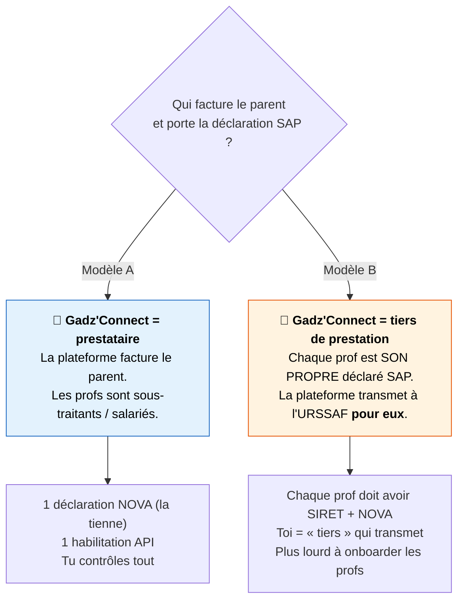
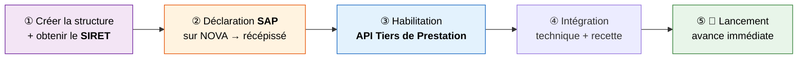
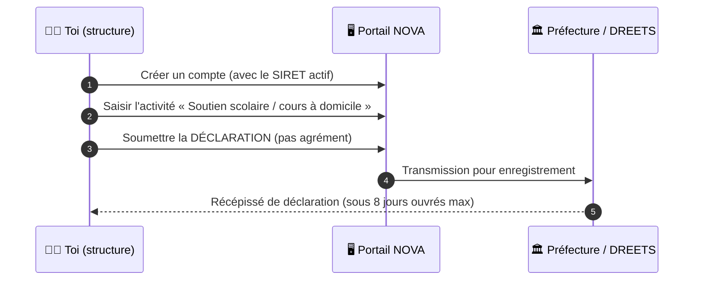
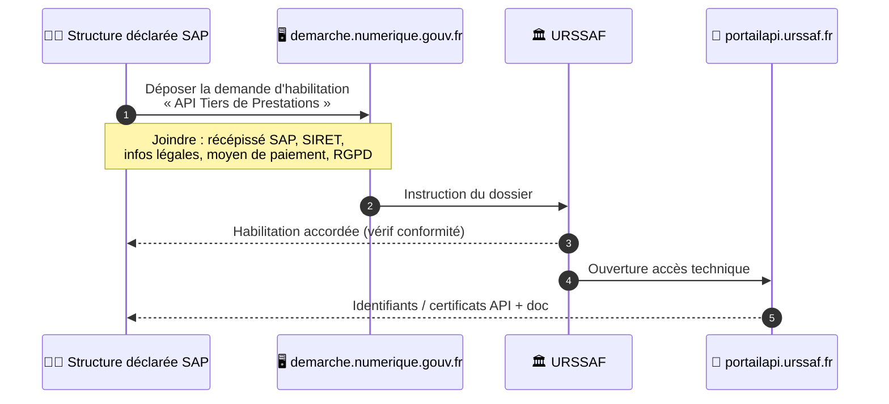

# 🗺️ Guide complet — De zéro à l'habilitation Avance Immédiate

> **Ta situation :** tu as le produit techno, mais **rien administrativement**.
> **Ce guide te mène de « rien » jusqu'au droit d'utiliser l'API URSSAF** pour que le parent ne paie que 50 %.

> **Réponse directe à ta question :**
> ❓ *Faut-il créer une structure officielle ?* → **OUI, obligatoire.** On ne peut pas obtenir de numéro SAP sans un **SIRET actif**.
> ❓ *Agrément compliqué ?* → **NON.** Le soutien scolaire relève de la **simple déclaration** (le lourd « agrément » ne concerne que la petite enfance / personnes fragiles). La déclaration est **gratuite**.

---

## ⛔ Les 3 conditions qui font TOUT capoter si non respectées

Avant les étapes, grave ça dans le marbre — c'est ce qui fait **accepter ou refuser** ton dossier :

1. **Cours en présentiel, au domicile de l'élève.** La visio = **zéro crédit d'impôt** et **refus d'agrément**. Non négociable.
2. **Condition d'activité (ex-« exclusivité »).** Historiquement il fallait faire *uniquement* du service à la personne. Depuis le **1er janvier 2025** (décret du 25/07/2024), un **micro-entrepreneur** peut avoir une activité accessoire **< 30 % du CA** avec **comptabilité séparée**. Au-delà, tu perds le bénéfice fiscal.
3. **Comptabilité / facturation traçables.** Suivi rigoureux des prestations, factures conformes, paiements traçables. L'URSSAF peut contrôler.

---

## 🍴 Décision n°1 (à trancher AVANT tout) : quel modèle juridique ?

C'est **la** décision structurante. Gadz'Connect met en relation profs et parents → **qui est la structure déclarée SAP ?**



| | **Modèle A — Prestataire** | **Modèle B — Tiers de prestation** |
|---|---|---|
| Qui est déclaré SAP | **Gadz'Connect** (1 seule déclaration) | **Chaque prof** (une déclaration chacun) |
| Qui facture le parent | Gadz'Connect | Le prof (via la plateforme) |
| Habilitation API | 1 seule, pour toi | Toi = tiers technique pour N profs |
| Complexité admin de départ | **Faible** (1 dossier) | Élevée (N dossiers profs) |
| Statut des profs | Salariés ou sous-traitants (URSSAF, cotisations…) | Indépendants (chacun son SIRET) |
| **Reco pour démarrer** | ✅ **le plus simple pour lancer** | Mieux à grande échelle mais lourd au début |

> 💡 **Recommandation pour partir de zéro : Modèle A.** Une seule structure, une seule déclaration, une seule habilitation. Tu maîtrises le flux de bout en bout. Tu pourras évoluer vers le Modèle B plus tard.
>
> ⚠️ **Attention statut des profs** en Modèle A : s'ils ne sont pas salariés, la relation « plateforme qui fixe prix + encadre » peut être requalifiée en salariat. À cadrer avec un expert-comptable / juriste.

---

## 🪜 Le parcours complet (Modèle A)



---

### ① Créer la structure juridique + obtenir le SIRET

Tu dois avoir une **entité immatriculée**. Options, du plus simple au plus solide :

| Forme | Pour qui | Avantages | Limites |
|-------|----------|-----------|---------|
| **Micro-entreprise** (auto-entrepreneur) | Tester vite, seul | Création gratuite en ligne, comptabilité ultra-light, **plus d'exclusivité depuis 2025** | Plafond de CA, image « perso », mal adaptée si tu emploies des profs |
| **SASU / SAS** | Vraie boîte, lever des fonds, embaucher | Crédible, associés possibles, responsabilité limitée | Compta + coûts de création (~200–500 €) |
| **Association loi 1901** | Projet école/gadz non lucratif | Légitimité, subventions | Cadre non lucratif contraignant pour un vrai business |

> 💡 **Reco :** commence en **micro-entreprise** pour valider le pilote (rapide, gratuit), puis bascule en **SASU/SAS** quand le modèle est prouvé. Une **SAS** est le bon véhicule si tu veux employer des profs et lever des fonds.

**Démarche :** immatriculation sur le **guichet unique** (`formalites.entreprises.gouv.fr`). Choisir un **code APE cohérent** (ex. *85.59B — enseignement / soutien scolaire*). Tu reçois ton **SIRET** sous quelques jours.

**➡️ Sortie de l'étape : un SIRET actif.**

---

### ② Déclaration SAP sur NOVA (le fameux « numéro SAP »)

**NOVA** = le portail officiel des services à la personne (géré par la DGE).



- **Type :** une **DÉCLARATION** suffit pour le soutien scolaire (pas d'agrément).
- **Coût :** **gratuit**.
- **Délai :** récépissé sous **8 jours ouvrés** maximum après enregistrement au répertoire SIRENE.
- **Effet :** c'est CE récépissé qui **ouvre le droit au crédit d'impôt 50 %** pour tes clients et **permet l'avance immédiate**.

**➡️ Sortie de l'étape : ton numéro/récépissé de déclaration SAP.**

---

### ③ Habilitation à l'API Tiers de Prestation (URSSAF)

C'est l'autorisation d'utiliser l'API pour automatiser l'avance immédiate.



- **Où :** `demarche.numerique.gouv.fr` → « API Tiers de Prestations ».
- **Pré-requis :** avoir **déjà** le récépissé SAP (étape ②).
- **Ce qu'on vérifie :** conformité **légale** (structure, SAP), **organisationnelle** (facturation, suivi) et **technique**.
- **Puis :** accès à `portailapi.urssaf.fr` → clés API + doc technique + **environnement de recette**.

**➡️ Sortie de l'étape : accès API en sandbox, puis en prod.**

---

### ④ Intégration technique + recette

C'est la partie que TON produit sait déjà faire. Voir le doc dédié :
👉 [avance-immediate-automatisation.md](avance-immediate-automatisation.md)

- Intégrer les 4 méthodes (inscrire client, statut, demande de paiement, consultation).
- Tester en **sandbox** : inscrire un client de test, envoyer une demande, suivre les statuts.
- Passage en **prod** après validation.

---

## ⏱️ Timeline & budget réalistes (départ de zéro)

```
Semaine 0        Immatriculation → SIRET               (quelques jours, gratuit à ~500 €)
Semaine 1-2      Déclaration NOVA → récépissé SAP       (≤ 8 jours ouvrés, gratuit)
Semaine 2-6      Habilitation API Tiers de Prestation   (quelques semaines, gratuit)
Semaine 4-8      Intégration + recette (en parallèle)   (selon ton équipe)
──────────────────────────────────────────────────────────────────────────
≈ 1,5 à 3 mois pour être opérationnel en avance immédiate
```

| Poste | Coût |
|-------|------|
| Micro-entreprise | **0 €** |
| SASU/SAS (statuts, annonce légale) | **~200–500 €** (ou + avec avocat) |
| Déclaration NOVA (SAP) | **0 €** |
| Habilitation API URSSAF | **0 €** |
| Expert-comptable (recommandé) | variable |

---

## ✅ Checklist « pour que ça soit accepté »

- [ ] **SIRET actif** avec un **code APE cohérent** (enseignement / soutien scolaire).
- [ ] Activité déclarée = **soutien scolaire / cours à domicile** (dans la liste des 26 activités SAP).
- [ ] Prestations **en présentiel au domicile** de l'élève (⚠️ **pas de visio** dans le périmètre SAP).
- [ ] Respect de la **condition d'activité** (micro : accessoire < 30 % du CA, compta séparée).
- [ ] **Facturation conforme** + suivi traçable des prestations.
- [ ] **Récépissé SAP** obtenu **avant** de demander l'habilitation API.
- [ ] Dossier d'habilitation complet (légal + organisationnel + technique + RGPD).
- [ ] **Conformité RGPD** (tu vas stocker état civil, IBAN, potentiellement NIR).
- [ ] Statut des profs **cadré juridiquement** (salariat vs sous-traitance).

---

## 🧭 Résumé en 6 lignes

1. **Crée une structure** (micro-entreprise pour tester, SAS pour scaler) → **SIRET**.
2. **Déclare l'activité SAP** sur **NOVA** → récépissé sous 8 jours (**gratuit**).
3. **Demande l'habilitation API Tiers de Prestation** sur *demarche.numerique.gouv.fr* (**gratuit**).
4. **Intègre l'API** (sandbox → prod) — ton produit sait faire.
5. **Contrainte absolue :** cours **à domicile en présentiel**, sinon tout tombe.
6. **≈ 1,5 à 3 mois** et **quasi 0 €** d'administratif pour offrir le « je paie 50 % ».

---

### Sources
- [Services à la personne (gouv.fr) — Soutien scolaire / cours à domicile](https://www.servicesalapersonne.gouv.fr/beneficier-des-sap/quelles-sont-activites-de-services-la-personne/soutien-scolaire-ou-cours-domicile)
- [Wecasa — Déclaration SAP via NOVA (démarche)](https://help.wecasa.fr/fr/articles/2531080-declaration-d-organisme-de-services-a-la-personne-via-nova-comment-l-obtenir)
- [Abby — Déclaration NOVA micro-entrepreneur (SIRET requis, exclusivité 2025)](https://abby.fr/guide/micro-entreprise/declaration-nova-services-personne)
- [LegalPlace — Créer son entreprise de soutien scolaire](https://www.legalplace.fr/guides/creer-entreprise-soutien-scolaire/)
- [demarche.numerique.gouv.fr — Habilitation API Tiers de Prestations](https://demarche.numerique.gouv.fr/commencer/api-tiers-de-prestations)
- [CoursProfs — Auto-entrepreneur & agrément simple (exclusivité, visio exclue)](https://www.coursprofs.fr/blog/autoentrepreneur-agrement-simple.php)
